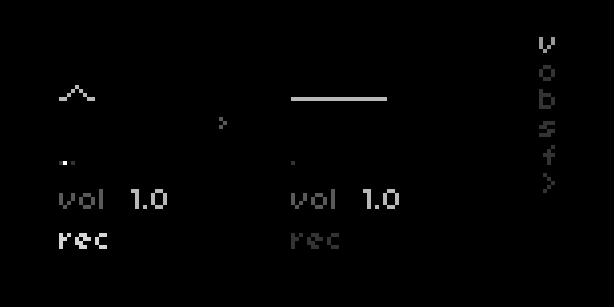

# ~ wrms ~~
dual stereo time-wigglers / echo loopers

two time-travel wrms for loops, delays, & everything in-between

### requirements
- norns
- audio input

### download
head to `norns.local` + click on the books, tab over to available, then scroll way down to wrms & click install 

# how 2 wrm

the first thing you should know is that E1 changes which page is displayed. pages contain different controls, mapped to the lower keys and encoders. the location of the control on-screen (left, right, center) shows which wrm will be affected by your control messing.

the first time you meet the wrms wrm1 (on the left) will be set up as a delay & wrm 2 (on the right) will be configured as a looper pedal. feed the wrms some audio to begin exploring ! tap K3 once to begin recording a loop, then again to begin playback.

# controls

## main screen

- **vol:** the easy one ! change the volume of each respective wrm
- **rec:** set the record state. if the wrm is **asleep** (flat line) rec will punch in a new loop time. for an **awake** wrm (wiggling), rec sets whether the loop is **overdubbing** new material, or causes a stutter freeze in a delay. in an awake state, hold rec to **clear** the loop (or delay) and put the wrm to sleep. if wrm 1 is being a delay, you can use rec to turn it into a looper (!!).
- **old:** set the **overdub/delay feedback** level - the rate at which old material fades away. turn it up in a delay for long echo tails, or turn it down in a loop for tape decay memory loss.
- **bd:** bnd is the simplest time warping control - K2 fine-tunes wrm1 between 1x & 2x pitch/speed for instant delay bendiness 
    - <Summmary> (when orbiting a black hole, the rate of time is inversely proportional to orbital altitude). 

- **wgl:** wgl is a slow LFO routed to the pitch of both wrms, causing various orbital instabilities. set it to around 0.08 for pleasant tape wow/flutter, or paitiently turn it up to 100 to pass through the singularity & back.
- **<< >>:** octave transports (mapped to K2 & 3) double and halve the rate of time hold & release either key for a playable tape glide effect. pressing or holding both keys at once will reverse time.
