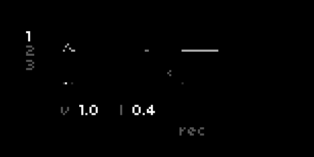

# ~ wrms ~~

dual stereo time-wigglers / echo loopers

two time-travel wrms for loops, delays, & everything in-between

## requirements

- norns (update 210607 or later)
- audio input

## download

available from the maiden catalog

## documentation

the first thing you should know is that E1 changes which page is displayed. pages contain different controls, mapped to the lower keys and encoders. the location of the control on-screen (left, right, center) shows which wrm is mapped to that control.

the first time you meet the wrms, wrm1 (on the left) will be set up as a delay & wrm 2 (on the right) will be configured as a looper pedal. feed the wrms some audio to begin exploring ! tap K3 once to begin recording a loop, then again to begin playback.

### main screen

- **vol:** the easy one ! change the volume of each respective wrm
- **rec:** set the record state.
  - if the wrm is asleep (flat line) toggling rec will punch in a new loop time.
  - for an awake wrm (wiggling), rec sets whether the loop is overdubbing new material, or causes a stutter freeze in a delay.
  - in an awake state, hold rec to clear the loop (or delay) and put the wrm to sleep. if wrm 1 is being a delay, you can use rec to turn it into a second looper (!!).
  - you can map this to a midi food pedal (**rec** & **clear** params)
- **old:** set the overdub/delay feedback level - or the rate at which old material fades away. turn it up in a delay for long echo tails, or turn it down in a loop for tape decay memory loss.
- **bnd:** bnd is the simplest time warping control - K2 fine-tunes wrm1 between 1x & 2x pitch/speed for instant delay bendiness
  - <Summmary> (when orbiting a black hole, the rate of time is inversely proportional to orbital altitude). 

- **wgl:** wgl is a slow LFO routed to the pitch of both wrms, causing various orbital instabilities. set it to around 0.08 for pleasant tape wow/flutter, or paitiently turn it up to 100 to pass through the singularity.
- **<< & >>:** octave transports double and halve the rate of time. hold & release a key for a playable tape glide effect. pressing and releasing both keys at once will reverse time.
- **s & l:** the start & length of the playback window.
  - in delay mode, "l" is the most useful as it sets the time between repeats - ranging from 4-second phrase repeats down to resonator-like phasing at 1 millisecond.
  - in loop scenarios (esp. with shared buffers) both controls can be used to modify the playback window or scan around buffer space for microlooping or pseudo-granular textures.
  - (hint: if you cleared wrm1 to put it to sleep, "l" is how you wake it back up as a delay - just increase length from 0.)
- **> & <:** the feed controls set the routing between wrms. by default, the delaying wrm is feed into a looping one, but some may prefer loop into delay. you can also turn up both mix points for a chaotic feedback loop, or set up an infinitely rising pitch cascade when sharing buffers at different recording rates.
- **buf:** simple on the surface, but radical in application, buffer selection allows the wrms to share the same chunk of spacetime memory.
  - assigning wrm 1 to buffer 2 yeilds a second asynchronous window into a loop, which you can fine-tune with s, l, and playback speeds.
  - assigning wrm 2 to buffer 1 yeilds a second delay tap which can re-pitch the audio recorded into wrm 1 (in the style of [alliterate](https://github.com/andr-ew/prosody#alliterate), stymon magneto, count to five).
  - (hint: sharing buffers will always result in clicks whenever the two playheads cross, but the filters help soften things & they kick in automatically when buf is changed)
- **f & q:** these set a wrm's filter cutoff & resonance. the K2&3 below set the filter responce (you'll need to take things off of dry befor you hear anything). by default, wrm1's delay will feed back through the filter each repeat which makes for a pleasant analog tone but can get screachy at higher resonances.

### params

- the **mix** section has a handful of useful level controls not available on the main screen. **input routing** will be important when using mono inputs.
  - "mono" sends both inputs to both wrms in mono
  - "2x mono" sends L in to wrm 1 only and R in to wrm 2 only
- in the **wrms** section all main & alt params are available for midi mapping (including for midi foot switches)
- **options** contains a few extra settings
  - **wgl dest:** set whether wrm 1, wrm 2, or both are affected by the wgl LFO. set this to wrm1 to wiggle just the delay & record your wiggles into the wrm2 loop
  - **reset:** reset all params to their default values
- the **crow** section allows you to map most controls to crow inputs (using @21echos' crowify).

### alt

holding K1 reveals a hidden batch of controls behind every page. these are meant to be complimentary to the main performance controls - extra tweaks & easter eggs that open up new sounds once some familiarity has been established. note that in the case of pages **s** and **f**, the alt page simply reveals the same controls mapped to wrm2.

- **sk:** skew the length of each loop channel in the stereo spectrum. great for stereofying mono sources.
- **res:** trigger playhead from 0. this is most useful as a mapping destination for crow triggers, which allows for synced delays in a modular context.
- **ph:** set the phase separation of loop playback in the stereo spectrum.
- **tap:** a tap tempo control for delay or loop lengths
- **wgrt:** rate of the wgl LFO
- **tp**: semitone pitch transposition, also useful as a wide-range pitch bend
- **pan**: sets the _input_ pan for each wrm. K2 on this screen sets the overdub mode for wrm1 - in the default ping-pong mode, panning a mono source will bring in the the stereo ping-pong effect.
- **aliasing:** toggling on will disable anti-aliasing for both record heads. the effect is most noticible when recording at lower rates, especially when bent & wiggled.

### wrms/lite

wrms ships with an alternate version of the script, "lite", which you can access from the main SELECT menu on norns. It's essentially a simplified version of vanilla wrms that falls closer to a traditional dealy & looper pedal. this might be a good place to start if you're new to wrms ! (the chosen controls & presets were based on those used on jade islan sayson's [paru paro](https://jadeislansayson.bandcamp.com/album/paru-paro))

- **rec:** record a loop in wrm 2. tap K2 once to begin recording a loop, then again to begin playback. while playing, rec toggles whether new audio is overdubbed. hold K2 to clear.
- **v:** set the volume of the wrm 1 echo
- **l:** set the length of time bewteen echos
- **old:** set decide how much old audio remains between repeats. turn it up on wrm 1 for longer echo tails, or turn it down in wrm 2 for tape decay memory loss.
- **bnd:** pitch bend wrm 1. this changes the echo time and repitches the echo momentarily.
- **wgl:** add a slow, tape-like pitch wobble to both wrms. set it to around 0.08 for pleasant tape wow/flutter, or paitiently turn it up to 100 to pass through the singularity.
- **<< & >>:** octave transports to double and halve the rate of time in wrm 2. hold & release a key for a playable tape glide effect. pressing and releasing both keys at once will reverse time.

even in the lite template, the full collection of controls are still accessible under PARAMS > EDIT.
